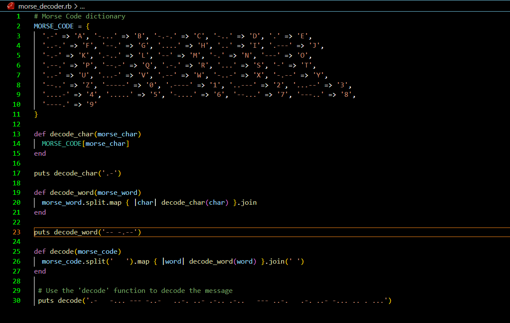

## Morse Code Decoder

<a name="readme-top"></a>
<div align="center">
    
  <br/>
  <h3><b>Morse Code Decoder</b></h3>
</div>
# 📗 Table of Contents

- [📗 Table of Contents](#-table-of-contents)
- [📖 Morse Code Decoder Morse Code Ruby](#-morse-code-decoder-morse-code-ruby)
  - [🛠 Built With ](#-built-with-)
    - [Tech Stack ](#tech-stack-)
    - [Key Features ](#key-features-)
  - [💻 Getting Started ](#-getting-started-)
    - [Prerequisites](#prerequisites)
    - [Setup](#setup)
    - [Install](#install)
    - [Usage](#usage)
    - [Run tests](#run-tests)
    - [Deployment](#deployment)
  - [👥 Authors ](#-authors-)
  - [🔭 Future Features ](#-future-features-)
  - [🤝 Contributing ](#-contributing-)
  - [📝 License ](#-license-)

# 📖 Morse Code Decoder <a name="about-project">Morse Code Ruby</a>

**Morse Code Decoder** is a Morse Code decoder written in Ruby. Its primary goal is to decode Morse Code messages into English text.

Description:

During a seaside vacation, numerous old bottles containing parchments with Morse code messages were discovered. This led to the creation of this Ruby program, which is designed to automate the process of Morse code decryption.

The program can convert a string of Morse code into English. It understands Morse code representations for all alphabets (both lower case and upper case), and numbers from 0-9.

## 🛠 Built With <a name="built-with"></a>

### Tech Stack <a name="tech-stack"></a>

<details>
<summary>Backend</summary>
  <ul>
    <li><a href="https://www.postgresql.org/">Ruby</a></li>
  </ul>
</details>

### Key Features <a name="key-features"></a>

- **Converts a single Morse code character into its corresponding English character.**
- **Decodes an entire Morse code word into its corresponding English word..**
- **Decodes an entire Morse code message into its corresponding English sentence.**

<p align="right">(<a href="#readme-top">back to top</a>)</p>


## 💻 Getting Started <a name="getting-started"></a>

To get a local copy up and running, follow these steps.

### Prerequisites

In order to run this project you need:

[Install Ruby](https://www.ruby-lang.org/en/documentation/installation/)

### Setup

```sh
  cd my-folder
  git clone https://github.com/Alejandroq12/morse-decoder.git
```

### Install

This project does not require additional dependencies, just Ruby interpreter. However, it uses RuboCop as a linter and you should set it up as well.

```sh
bundle install
```

### Usage

To run the project, navigate to the project directory and execute the following command:

```sh
  ruby morse_tranlator.rb
```

### Run tests

To run tests, run the following command:

Run the following command
```sh
rubocop
```

### Deployment

You can deploy this project using:

Not available at the moment.

<p align="right">(<a href="#readme-top">back to top</a>)</p>


## 👥 Authors <a name="authors"></a>


👤 **Santiago Munoz**

- GitHub: [@smunoz](https://github.com/smunoz1988)
- Twitter: [@twitterhandle](https://twitter.com/Santiag24209785)
- LinkedIn: [LinkedIn](https://www.linkedin.com/in/santiago-munoz-0b2b1a260)

👤 **Julio Quezada**

- GitHub: [Alejandroq12](https://github.com/Alejandroq12)
- Twitter: [@JulioAle54](https://twitter.com/JulioAle54)
- LinkedIn: [Julio Quezada](https://www.linkedin.com/in/quezadajulio/)

<p align="right">(<a href="#readme-top">back to top</a>)</p>

## 🔭 Future Features <a name="future-features"></a>

- **We will add a GUI.**

<p align="right">(<a href="#readme-top">back to top</a>)</p>

## 🤝 Contributing <a name="contributing"></a>

Contributions, issues, and feature requests are welcome!

<p align="right">(<a href="#readme-top">back to top</a>)</p>

## 📝 License <a name="license"></a>

This project is [MIT](./LICENSE) licensed.

<p align="right">(<a href="#readme-top">back to top</a>)</p>